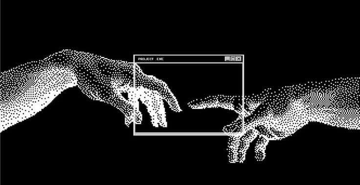

  
  

 

<h2> <em>About  me </em></h2>

 

  I’m a 19-year-old engineering student driven by curiosity, discipline, and the desire to build meaningful things through technology. I see software not just as lines of code, but as structured ideas that can solve real problems and create real impact.

I’m deeply interested in understanding how systems work — from logic and architecture to the details that make everything run smoothly. I enjoy breaking complex problems into smaller parts and finding efficient, thoughtful solutions. For me, growth comes from challenge, and challenge is something I actively seek.

 

   <em><b> Studying at the Tecnologico de Antioquia</b></em>  
   <em><b> Always learning, always improving</b></em> 
   <em><b> Turning ambition into action. </b></em> 
   <em><b> Quietly building my future. </b></em> 

 
 
<h2 align="center"> <em> Technologies </em> </h2>

  
  
  
  
  
  
  
  
  

 
 

<h2 align="center"">  <em> Statistics </em> </h2>

 

    

